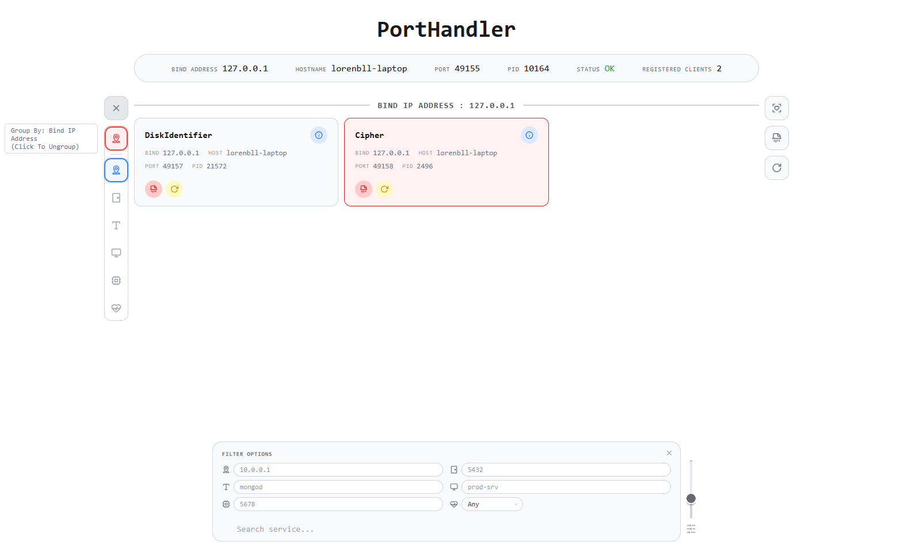

# ServiceHandler

ServiceHandler is a local web service registry with a web UI. It solves the problem of registering named services on the local machine so clients can look up each other by name, port, and metadata through a small HTTP API.

## About
ServiceHandler is scoped to service registration and discovery on the local device. The service binds to `127.0.0.1` on port `49155` and rejects API calls that do not come from the local device. Registered clients are kept in memory only — each service must re-register every time ServiceHandler starts. A background health-check thread pings registered clients every 15 seconds and removes unreachable ones.

The web UI (`ui/pages/index.html`) displays a dashboard with a status pill, a searchable and sortable grid of registered service cards, a sidebar for tweaking the sort order and group-by of columns, a health-check button, an accuracy slider for fuzzy search threshold, and checkbox-based batch selection for bulk actions.

**Features:**

- **Search** — real-time filtering with fuzzy matching (Levenshtein distance). The accuracy threshold defaults to 30% and is adjustable via a slider with a reset button.
- **Filter panel** — expandable filter menu with text inputs per column and a status dropdown (Any / Operational / Broken). Tab navigates in column-major order (top-to-bottom, then next column). Shift+Tab from the search input returns focus to the last filter.
- **Sort & Group-by** — drag-to-reorder sort columns; group by a selected key; sort order persisted across restarts. The group-by zone is always visible regardless of card count.
- **Status grouping** — services are automatically tagged as Operational or Broken; can be sorted/grouped by status.
- **Card expansion/collapse** — click a card to expand it with full metadata; collapse returns the card to its grid position.
- **Health check** — global button re-checks all services (shows a spinner, then reloads the grid with the active search/filter applied). Per-card health endpoint refreshes expanded content in-place. When services are selected via checkboxes, health check runs only on the selected subset and clears the selection afterward.
- **Batch selection** — hover over any card to reveal checkboxes; click to select individual cards. When one or more cards are selected, the search bar is replaced by Terminate Selected Services and Restart Selected Services buttons that span the card grid. Press Escape to clear selection.
- **Broken service management** — broken services shown with red styling immediately. "Forget All Broken Services" and "Restart All Broken Services" buttons for bulk actions.
- **Keyboard shortcuts** — search auto-focused on load. Escape clears checkbox selection, closes expanded card, sort menu, or filter menu. Tab navigates filter inputs in column-major order.
- **Accuracy slider** — adjustable fuzzy matching threshold (0-100%, default 30%). Persisted across restarts alongside sort settings.

> **Safety notice**: ServiceHandler is intended only for environments where safety is not a major risk — the chances of malevolent actors are low, and the consequences of an eventual mishap are low.

## Setup
1. Install Python dependencies: `pip install -r requirements.txt`.
2. Review `resources/configuration.json` if you want to change the port or set up API key encryption.
3. Leave the project structure intact so the service can find `resources/` and `src/`.

### API Key Encryption Setup (Optional)

ServiceHandler can encrypt stored API keys using the [Cipher](https://github.com/LorenBll/Cipher) and [DiskIdentifier](https://github.com/LorenBll/DiskIdentifier) services. To enable:

1. **Set the encryption key path** in `resources/configuration.json`:
   ```json
   "api_key_store_key_path": "<disk_id>\\path\\to\\encryption.key"
   ```
   - `<disk_id>` is a 64-character hex disk identifier resolved by [DiskIdentifier](https://github.com/LorenBll/DiskIdentifier).
   - The path after the disk ID is relative to the disk root returned by [DiskIdentifier](https://github.com/LorenBll/DiskIdentifier).
   - If left empty (`""`), API key registration is disabled.

2. Ensure **[DiskIdentifier](https://github.com/LorenBll/DiskIdentifier)** and **[Cipher](https://github.com/LorenBll/Cipher)** services are running and registered with ServiceHandler before making any API key requests. These services are discovered automatically from the registered clients list.

3. When a valid key path is configured and both services are available, ServiceHandler decrypts `resources/api_keys.json` on session initialization, stores the keys in memory, and re-encrypts the file. On each key grant, the file is updated with the new key and re-encrypted.

## Run
1. Windows: run `scripts\run.bat`.
2. Unix-like systems: run `bash scripts/run.sh`.
3. Manual: run `python src/main.py` from the project root.

## Access Control

All `/api/*` and `/ui/*` endpoints are local-device only. Requests from non-local addresses are rejected with:
- `403` -> `{ "error": "Local device access only." }`
- All endpoints also support `HEAD` and `OPTIONS`.
- API responses use `Connection: close`.

Sensitive endpoints require a valid API key, with these exceptions:

| Restriction level | Endpoints |
|---|---|
| **API key, localhost, or self-service** (POST) — accepts if any of: valid API key, localhost, or service acting on itself (hash is proof of identity) | `/api/service/terminate`, `/api/service/restart`, `/api/unregister/service`, `/api/broken/forget`, `/api/broken/restart`, `/api/services/healthcheck` |
| **Strict localhost or valid API key** (GET) — localhost allowed for bootstrapping | `/api/api-key/pending` |
| **Strict localhost or valid API key** (POST + involving_api_keys) — localhost allowed for bootstrapping | `/api/api-key/grant`, `/api/api-key/reject` |
| **Valid API key or localhost** (POST) | `/api/shutdown` |
| **Optional API key** — returns full data if authorized, basic data otherwise | `POST /api/question/service`, `GET /api/services` |
| **Hash-only auth** — service must provide its own hash, no API key option | `POST /api/register/endpoint` |
| **No auth required** | `POST /api/service/endpoints`, `POST /api/endpoints/service`, `GET /api/services/endpoints` |

All endpoints that accept a `hash` parameter use `_check_authorization_all`, which grants access if: a valid API key is provided, the request comes from localhost, **or** the hash corresponds to a known registered service (self-service — knowing the hash is proof of identity). ServiceHandler's own localhost requests are also accepted.

When authorization fails, the response is `403` with `{ "error": "API key is not valid." }`. Non-local requests are rejected at the firewall level before any endpoint-specific auth runs, returning `403` with `{ "error": "Local device access only." }`.

These restrictions apply to the main HTTP method only; `HEAD` and `OPTIONS` are unaffected.

## API Endpoints

### `GET /` (also `HEAD`, `OPTIONS`)
Serves the web UI dashboard (`ui/pages/index.html`).
- Auth: local-device only (no API key required)
- Body: none
- Returns:
	- `200` -> `text/html`

### `GET /css/<path:filename>` (also `HEAD`, `OPTIONS`)
Serves static CSS files from the `ui/css/` directory.
- Auth: local-device only (no API key required)
- Path parameters:
	- `filename` (string, required): path to a CSS file relative to `ui/css/`.
- Body: none
- Returns:
	- `200` -> `text/css`
	- `404` -> HTML error page

### `POST /api/register/service` (also `HEAD`, `OPTIONS`)
Registers a new client service and returns a SHA-256 hash. Before registering, ServiceHandler probes the new client's health endpoint (`/api/health`) to confirm it is reachable.
- Auth: local-device only (no API key required)
- Body (JSON object):
	- `name` (string, required): name for the client service.
	- `port` (number, required): port number the client listens on (1–65535).
	- `pid` (number, required): process ID of the running client.
	- `bind_address` (string, required): IP address the client binds to.
	- `hostname` (string, required): hostname of the client machine.
	- `starting_script` (string, optional): path to the client's startup script.

	If a client with the same `name` is already registered, ServiceHandler checks whether that existing client is still alive. If it is, registration is rejected. If it is not, the stale registration is replaced.

	The recommended value for `starting_script` is the OS-appropriate run script — `scripts/run.bat` on Windows or `scripts/run.sh` on Unix — not the `main.py` file directly.

- Returns:
	- `201` ->
		```json
		{ "hash": "<sha256-hash>" }
		```
	- `400` -> `{ "error": "A non-empty name is required." }`
	- `400` -> `{ "error": "A port number is required." }`
	- `400` -> `{ "error": "Port must be a number between 1 and 65535." }`
	- `400` -> `{ "error": "A PID is required." }`
	- `400` -> `{ "error": "A bind address is required." }`
	- `400` -> `{ "error": "A hostname is required." }`
	- `400` -> `{ "error": "Client health endpoint is not reachable." }`
	- `409` -> `{ "error": "A client with name '...' is already registered." }`

### `POST /api/question/service` (also `HEAD`, `OPTIONS`)
Looks up a registered client's data by name. The service name can be passed either as a URL path parameter (`/api/question/service/<name>`) or in the JSON body. No registration is required to ask.
- Auth: optional API key — returns full data if authorized (valid API key or localhost), basic data (name + port) otherwise
- Body (JSON object):
	- `name` (string, optional if provided in path): name of the target client to look up.
	- `api_key` (string, optional): API key for full data access.
- Returns (no API key or unauthorized):
	- `200` ->
		```json
		{
			"name": "<target-name>",
			"port": <target-port>
		}
		```
- Returns (valid API key):
	- `200` ->
		```json
		{
			"hash": "<sha256>",
			"name": "<target-name>",
			"port": 8080,
			"starting_script": "scripts/run.bat",
			"pid": 12345,
			"bind_address": "127.0.0.1",
			"hostname": "my-host",
			"ip": "127.0.0.1",
			"timestamp": "2025-01-01T00:00:00"
		}
		```
	- `400` -> `{ "error": "The name of the target client is required." }`
	- `403` -> `{ "error": "API key is not valid." }`
	- `404` -> `{ "error": "No client found with name '...'." }`

### `DELETE /api/unregister/service` (also `HEAD`, `OPTIONS`)
Unregisters a client by its hash.
- Auth: API key, localhost, or self-service (any registered service that knows its own hash)
- Body (JSON object):
	- `hash` (string, required): SHA-256 hash of the client to unregister.
	- `api_key` (string, optional): API key to authenticate the request from a non-localhost client.
- Returns:
	- `200` ->
		```json
		{
			"status": "unregistered",
			"hash": "<hash>"
		}
		```
	- `400` -> `{ "error": "A hash is required to unregister." }`
	- `403` -> `{ "error": "API key is not valid." }`
	- `404` -> `{ "error": "Hash not found." }`

### `GET /api/health` (also `HEAD`, `OPTIONS`)
ServiceHandler's own health check with registration statistics.
- Auth: local-device only (no API key required)
- Body: none
- Returns:
	- `200` ->
		```json
		{
			"status": "ok",
			"service": "ServiceHandler",
			"bind_address": "127.0.0.1",
			"port": 49155,
			"pid": 12345,
			"hostname": "workstation-name",
			"registered_clients": 0
		}
		```

### `GET /api/services` (also `HEAD`, `OPTIONS`)
Returns the list of all registered clients. The `endpoints` field is never included — use `GET /api/services/endpoints` for endpoint data.
- Auth: optional API key — returns full data including hashes if authorized (valid API key or localhost), basic data without hashes otherwise
- Body (JSON object):
	- `api_key` (string, optional): API key to receive full client data including hashes.
- Returns (unauthorized):
	- `200` ->
		```json
		{
			"clients": [
				{
					"name": "my-service",
					"port": 8080,
					"pid": 12345,
					"ip": "127.0.0.1",
					"timestamp": "2025-01-01T00:00:00",
					"starting_script": "scripts/run.bat",
					"bind_address": "127.0.0.1",
					"hostname": "my-host"
				}
			]
		}
		```
- Returns (localhost or valid API key):
	- `200` ->
		```json
		{
			"clients": [
				{
					"hash": "<sha256>",
					"name": "my-service",
					"port": 8080,
					"pid": 12345,
					"ip": "127.0.0.1",
					"timestamp": "2025-01-01T00:00:00",
					"starting_script": "scripts/run.bat",
					"bind_address": "127.0.0.1",
					"hostname": "my-host"
				}
			]
		}
		```
	- `403` -> `{ "error": "API key is not valid." }` (only when an invalid API key is explicitly provided)

### `POST /api/register/endpoint` (also `HEAD`, `OPTIONS`)
Registers an endpoint for a registered service. The service authenticates by providing its own hash — knowing the hash is proof of identity. No API key option is available.
- Auth: hash-only — the hash must correspond to a registered service
- Body (JSON object):
	- `hash` (string, required): SHA-256 hash of the service registering the endpoint.
	- `verb` (string, required): HTTP verb for the endpoint (e.g. `GET`, `POST`).
	- `path` (string, required): URL path of the endpoint.
	- `path_variables` (array of strings, optional): list of variable names used in the path.
	- `body_schema` (object, optional): JSON schema for the request body.
	- `description` (string, required): human-readable description of what the endpoint does.
- Returns:
	- `201` ->
		```json
		{
			"status": "registered",
			"endpoint": {
				"verb": "GET",
				"path": "/api/data",
				"path_variables": ["id"],
				"body_schema": {},
				"description": "Retrieves data by ID"
			}
		}
		```
	- `400` -> `{ "error": "A hash is required." }`
	- `400` -> `{ "error": "A non-empty HTTP verb is required." }`
	- `400` -> `{ "error": "A non-empty endpoint path is required." }`
	- `400` -> `{ "error": "A non-empty description is required." }`
	- `404` -> `{ "error": "Service not found." }`

### `POST /api/service/endpoints` / `POST /api/endpoints/service` (also `HEAD`, `OPTIONS`)
Returns the list of endpoints registered for a given service name. The service name can be passed either as a URL path parameter (`/api/service/endpoints/<name>` or `/api/endpoints/service/<name>`) or in the JSON body.
- Auth: none
- Body (JSON object):
	- `name` (string, optional if provided in path): name of the registered service.
- Returns:
	- `200` ->
		```json
		{
			"name": "my-service",
			"endpoints": [
				{
					"verb": "GET",
					"path": "/api/data",
					"path_variables": ["id"],
					"body_schema": {},
					"description": "Retrieves data by ID"
				}
			]
		}
		```
	- `400` -> `{ "error": "The name of the service is required." }`
	- `404` -> `{ "error": "No service found with name '...'." }`

### `GET /api/services/endpoints` (also `HEAD`, `OPTIONS`)
Returns the complete list of registered services along with their registered endpoints. Each entry only includes `name`, `ip`, `port`, and `endpoints`.
- Auth: none
- Body: none
- Returns:
	- `200` ->
		```json
		{
			"clients": [
				{
					"name": "my-service",
					"ip": "127.0.0.1",
					"port": 8080,
					"endpoints": [
						{
							"verb": "GET",
							"path": "/api/data",
							"path_variables": ["id"],
							"body_schema": {},
							"description": "Retrieves data by ID"
						}
					]
				}
			]
		}
		```

### `POST /api/services/search-endpoints` (also `HEAD`, `OPTIONS`)
Searches endpoint descriptions across all registered services, returning matches with the service name.
- Auth: none
- Body (JSON object):
	- `query` (string, required): search term to match against endpoint descriptions (case-insensitive substring match).
- Returns:
	- `200` ->
		```json
		{
			"query": "encrypt",
			"results": [
				{
					"service": "my-service",
					"verb": "POST",
					"path": "/api/data/encrypt",
					"description": "Encrypt the given payload",
					"path_variables": [],
					"body_schema": {}
				}
			]
		}
		```
	- `400` -> `{"error": "A non-empty query is required."}`

### `GET /ui/sort-settings` (also `HEAD`, `OPTIONS`)
Returns the current column sort order, group-by key, and fuzzy accuracy threshold used by the web UI.
- Auth: local-device only (no API key required)
- Body: none
- Returns:
	- `200` ->
		```json
		{
			"sort_order": ["name", "port", "pid", "bind_address", "hostname", "status"],
			"group_by": "name",
			"original_sort_order": ["name", "port", "pid", "bind_address", "hostname", "status"],
			"accuracy": 30
		}
		```

### `PUT /ui/sort-settings` (also `HEAD`, `OPTIONS`)
Updates the column sort order, group-by key, and/or fuzzy accuracy threshold.
- Auth: local-device only (no API key required)
- Body (JSON object):
	- `sort_order` (array of strings, optional): column keys in desired order.
	- `group_by` (string or null, optional): key to group by, or `null` to ungroup.
	- `original_sort_order` (array of strings, optional): baseline sort order for the ungrouped view.
	- `accuracy` (number, optional): fuzzy matching threshold (0–100). Persisted and used as the default on page load.
- Returns:
	- `200` ->
		```json
		{
			"sort_order": ["port", "name", "pid"],
			"group_by": "name",
			"original_sort_order": ["port", "name", "pid"],
			"accuracy": 30
		}
		```
	- `400` -> `{ "error": "sort_order must be a non-empty list." }`
	- `500` -> `{ "error": "Failed to read/write configuration." }`

### `POST /api/service/terminate` (also `HEAD`, `OPTIONS`)
Terminates a registered client process and unregisters it.
- Auth: API key, localhost, or self-service (any registered service that knows its own hash)
- Body (JSON object):
	- `hash` (string, required): SHA-256 hash of the client to terminate.
	- `pid` (number, optional): process ID to kill. If omitted, the server looks up the stored PID for the client.
	- `api_key` (string, optional): API key to authenticate the request from a non-localhost client (not needed for self-service or localhost).
- Returns:
	- `200` ->
		```json
		{
			"status": "terminated",
			"hash": "<hash>",
			"pid": 12345
		}
		```
	- `400` -> `{ "error": "A hash is required." }`
	- `400` -> `{ "error": "No PID available for this service." }`
	- `403` -> `{ "error": "API key is not valid." }`
	- `500` -> `{ "error": "Failed to terminate process: ..." }`

### `POST /api/service/restart` (also `HEAD`, `OPTIONS`)
Restarts a registered client process via its start script. The starting script and PID are looked up from the server's stored client data.
- Auth: API key, localhost, or self-service (any registered service that knows its own hash)
- Body (JSON object):
	- `hash` (string, required): SHA-256 hash of the client.
	- `api_key` (string, optional): API key to authenticate the request from a non-localhost client (not needed for self-service or localhost).
- Returns:
	- `200` ->
		```json
		{
			"status": "restarted",
			"hash": "<hash>"
		}
		```
	- `400` -> `{ "error": "A hash is required." }`
	- `400` -> `{ "error": "Client not found." }`
	- `400` -> `{ "error": "No starting script available for this service." }`
	- `400` -> `{ "error": "No PID available for this service." }`
	- `403` -> `{ "error": "API key is not valid." }`
	- `500` -> `{ "error": "Failed to terminate process: ..." }`
	- `500` -> `{ "error": "Failed to start script: ..." }`

### `POST /api/broken/forget` (also `HEAD`, `OPTIONS`)
Removes a client from the broken list without requiring a termination. If the client is still registered, it is also unregistered and its process is killed if possible.
- Auth: API key, localhost, or self-service (any registered service that knows its own hash)
- Body (JSON object):
	- `hash` (string, required): SHA-256 hash of the broken client.
	- `api_key` (string, optional): API key to authenticate the request from a non-localhost client.
- Returns:
	- `200` ->
		```json
		{
			"status": "forgotten",
			"hash": "<hash>"
		}
		```
	- `400` -> `{ "error": "A hash is required." }`
	- `403` -> `{ "error": "API key is not valid." }`

### `POST /api/broken/restart` (also `HEAD`, `OPTIONS`)
Forgets a client from the broken list, kills its process if still running, then restarts it via its start script. The starting script is looked up from the server's stored client data.
- Auth: API key, localhost, or self-service (any registered service that knows its own hash)
- Body (JSON object):
	- `hash` (string, required): SHA-256 hash of the broken client.
	- `api_key` (string, optional): API key to authenticate the request from a non-localhost client.
- Returns:
	- `200` ->
		```json
		{
			"status": "restarted",
			"hash": "<hash>"
		}
		```
	- `400` -> `{ "error": "A hash is required." }`
	- `400` -> `{ "error": "No starting script available for this service." }`
	- `403` -> `{ "error": "API key is not valid." }`
	- `500` -> `{ "error": "Failed to start script: ..." }`

### `POST /api/services/healthcheck` (also `HEAD`, `OPTIONS`)
Checks the health of a specific client by hash, or all registered clients if no hash is given.
- Auth: API key, localhost, or self-service (any registered service that knows its own hash — only applies when checking a specific hash)
- Body (JSON object):
	- `hash` (string, optional): SHA-256 hash of a specific client to check. If omitted, all registered clients are checked.
	- `api_key` (string, optional): API key to authenticate the request from a non-localhost client.
- Returns (single client):
	- `200` ->
		```json
		{
			"hash": "<sha256>",
			"healthy": true
		}
		```
		or
		```json
		{
			"hash": "<sha256>",
			"healthy": false
		}
		```
	- `404` -> `{ "error": "Client not found." }`
- Returns (all clients):
	- `200` ->
		```json
		{
			"checked": true,
			"unhealthy": [
				{
					"hash": "<sha256>",
					"name": "my-service",
					"port": 8080,
					"pid": 12345,
					"ip": "127.0.0.1",
					"timestamp": "2025-01-01T00:00:00",
					"starting_script": "scripts/run.bat",
					"bind_address": "127.0.0.1",
					"hostname": "my-host"
				}
			]
		}
		```
	- `403` -> `{ "error": "API key is not valid." }`

### `POST /api/shutdown` (also `HEAD`, `OPTIONS`)
Shuts down the ServiceHandler service.
- Auth: API key or localhost
- Body (JSON object):
	- `api_key` (string, optional): API key to authenticate the request from a non-localhost client.
- Returns:
	- `200` ->
		```json
		{
			"status": "shutdown"
		}
		```
	- `403` -> `{ "error": "API key is not valid." }`

### `POST /api/service/protect` (also `HEAD`, `OPTIONS`)
Flags a registered service as protected. Protected services cannot be terminated, restarted, or forgotten by anyone.
- Auth: valid API key or localhost
- Body (JSON object):
	- `hash` (string, required): SHA-256 hash of the service to protect.
	- `api_key` (string, optional): API key to authenticate the request from a non-localhost client.
- Returns:
	- `200` ->
		```json
		{
			"status": "protected",
			"hash": "<sha256>"
		}
		```
	- `400` -> `{ "error": "A hash is required." }`
	- `403` -> `{ "error": "API key is not valid." }`
	- `404` -> `{ "error": "Client not found." }`

### `POST /api/service/unprotect` (also `HEAD`, `OPTIONS`)
Removes the protected flag from a registered service, allowing it to be terminated, restarted, or forgotten again.
- Auth: valid API key or localhost
- Body (JSON object):
	- `hash` (string, required): SHA-256 hash of the service to unprotect.
	- `api_key` (string, optional): API key to authenticate the request from a non-localhost client.
- Returns:
	- `200` ->
		```json
		{
			"status": "unprotected",
			"hash": "<sha256>"
		}
		```
	- `400` -> `{ "error": "A hash is required." }`
	- `403` -> `{ "error": "API key is not valid." }`
	- `404` -> `{ "error": "Client not found." }`

### `POST /api/api-key/request` (also `HEAD`, `OPTIONS`)
Submits an API key request for a registered client. The request enters a pending queue for the device owner to approve.
- Auth: hash-only — the hash must correspond to a registered service (no API key option)
- Body (JSON object):
	- `hash` (string, required): SHA-256 hash of the registered client requesting an API key.
- Returns:
	- `201` ->
		```json
		{
			"status": "pending",
			"message": "API key request registered. Awaiting approval."
		}
		```
	- `200` -> `{ "status": "already_pending", "message": "API key request is already pending." }`
	- `400` -> `{ "error": "A hash is required." }`
	- `404` -> `{ "error": "Client not found." }`
	- `503` -> `{ "error": "..." }` (API key session not available)

### `GET /api/api-key/pending` (also `HEAD`, `OPTIONS`)
Lists all pending API key requests with full details and an array of hashes.
- Auth: localhost or valid API key
- Body (JSON object):
	- `api_key` (string, optional): API key to authenticate the request from a non-localhost client.
- Returns:
	- `200` ->
		```json
		{
			"pending": [
				{
					"hash": "<sha256>",
					"name": "my-service",
					"port": 8080,
					"ip": "127.0.0.1",
					"timestamp": "2025-01-01T00:00:00"
				}
			],
			"hashes": ["<sha256>", "<sha256>"]
		}
		```
	- `403` -> `{ "error": "API key is not valid." }`

### `POST /api/api-key/grant` (also `HEAD`, `OPTIONS`)
Approves a pending API key request, generates a key, and notifies the requesting service. Requires the DiskIdentifier and Cipher services to be registered.
- Auth: localhost or valid API key
- Body (JSON object):
	- `hash` (string, required): SHA-256 hash from the pending request to grant.
	- `api_key` (string, optional): API key to authenticate the request from a non-localhost client.
- Returns:
	- `200` ->
		```json
		{
			"status": "granted",
			"api_key": "<128-hex-chars>",
			"service": "my-service",
			"notified": true
		}
		```
	- `400` -> `{ "error": "A hash is required." }`
	- `403` -> `{ "error": "API key is not valid." }`
	- `404` -> `{ "error": "No pending API key request for this client." }`
	- `500` -> `{ "error": "Failed to persist API key." }`
	- `503` -> `{ "error": "..." }` (API key session not available)

### `POST /api/api-key/reject` (also `HEAD`, `OPTIONS`)
Rejects a pending API key request and notifies the requesting service.
- Auth: localhost or valid API key
- Body (JSON object):
	- `hash` (string, required): SHA-256 hash from the pending request to reject.
	- `api_key` (string, optional): API key to authenticate the request from a non-localhost client.
- Returns:
	- `200` ->
		```json
		{
			"status": "rejected",
			"service": "my-service",
			"notified": true
		}
		```
	- `400` -> `{ "error": "A hash is required." }`
	- `403` -> `{ "error": "API key is not valid." }`
	- `404` -> `{ "error": "No pending API key request for this client." }`

---



## Support
- Open an issue on [GitHub](https://github.com/LorenBll/ServiceHandler/issues) for bug reports, feature requests, or help.

## License
- [LICENSE](LICENSE)

## Author
- [LorenBll](https://github.com/LorenBll)
